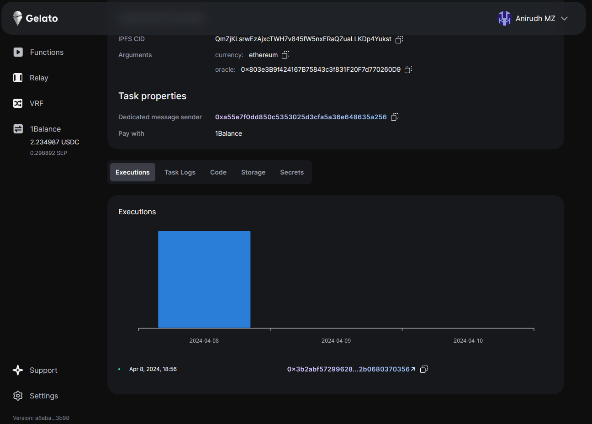

# Web3 Function Triggers

This repository provides a framework for triggering functions based on various events in the Ethereum blockchain. With Web3 function triggers, you can automate tasks and execute functions in response to predefined triggers, offering greater flexibility and efficiency in your decentralized applications (DApps).

## Trigger Types

### 1. Time Interval

Use this trigger to execute tasks at regular intervals, e.g., every 10 minutes or once every 24 hours. It's like setting a straightforward, recurring alarm.

### 2. Cron Expressions

This offers a more refined control compared to the Time Interval. With cron expressions, you can set tasks to run at specific moments, such as "every Tuesday at 3 PM" or "on the 1st of every month". It gives you precision in task scheduling.

### 3. On-Chain Event

Ideal for those wanting their tasks to respond dynamically to blockchain activities. Whenever a specified event occurs on the blockchain, e.g.,

```solidity
// Event creation with argument types and names
event ownerChanged(address indexed _from, address indexed _to);
```

### 4. Every Block

This trigger executes tasks every time a new block is mined on the blockchain.

But in this repository, we primarily focus on event triggers.

## Getting Started

### Contract

In this repo, we have a simple contract `EventOracle.sol` that emits an event `GetPriceEvent`. This event is triggered whenever the `getPrice()` function is called.

### Web3 Function

Summary of the logic:

- This script defines a Web3 function that retrieves the current price of a cryptocurrency from the Coingecko API and updates it on the blockchain using a specified oracle contract.
- It listens for a specific event emitted by the oracle contract and triggers the function when the event occurs.
- Upon triggering, it fetches the current price from the Coingecko API, encodes the update function call data, and returns it for execution on the blockchain

Check out the [`index.ts`](./web3-functions/simple-event/index.ts) file for the complete code.

## Testing

To test the Web3 function, you can run the following command:

```bash
yarn w3f:test
```

## Deploy your web3 function

Check out the docs [here](https://docs.gelato.network/web3-services/web3-functions/quick-start/test-deploy-and-run-typescript-functions#deploying-typescript-functions) to learn how to deploy your Web3 function

## Creating a Web3 Function Task

Check out the docs [here](https://docs.gelato.network/web3-services/web3-functions/quick-start/test-deploy-and-run-typescript-functions#creating-typescript-function-task) to learn how to create a Web3 function task on the app.

## Results

After deploying your Web3 function and creating a task, you should see the task being executed on the app when the event is emitted on the contract. You can also check the logs to see the output of the task.

<!-- insert image below -->


